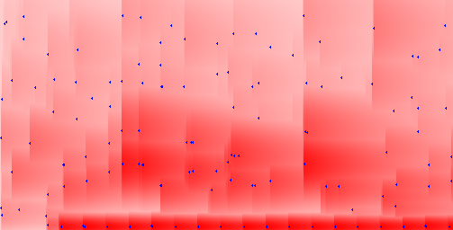

# Audio landmark fingerprinting as a Node Stream module

This module is a duplex stream (instance of stream.Transform) that converts a PCM audio signal into a series of audio fingerprints. It works with audio tracks as well as with unlimited audio streams, e.g. broadcast radio.

## Credits

The [acoustic fingerprinting](https://en.wikipedia.org/wiki/Acoustic_fingerprint) technique used here is the landmark algorithm, as described in the [Shazam 2003 paper](http://www.ee.columbia.edu/~dpwe/papers/Wang03-shazam.pdf).
The implementation in ```codegen_landmark.js``` has been inspired by the MATLAB routine of D. Ellis ["Robust Landmark-Based Audio Fingerprinting" (2009)](http://labrosa.ee.columbia.edu/matlab/fingerprint/). One significant difference with Ellis' implementation is that this module can handle unlimited audio streams, e.g. radio, and not only finished audio tracks.

Note the existence of another good landmark fingerprinter in Python, [dejavu](https://github.com/worldveil/dejavu).

## Description

In a nutshell,
- a spectrogram is computed from the audio signal
- significant peaks are chosen in this time-frequency map. a latency of 250ms is used to determine if a peak is not followed by a bigger peak.
- fingerprints are computed by linking peaks with ```dt```, ```f1``` and ```f2```, ready to be inserted in a database or to be compared with other fingerprints.


In the background, about 12s of musical content is represented as a spectrogram (top frequency is about 10kHz). The blue marks are the chosen spectrogram peaks. Grey lines are peaks pairs that each lead to a fingerprint.



Given the same audio, this figure shows the same peaks and the internal *forward* threshold that prevent peaks from being too close in time and frequency. The *backward* threshold selection is not represented here.

## Usage

```sh
npm install stream-audio-fingerprint
```

The algorithm is in ```codegen_landmark.js```.

A demo usage, using [ffmpeg](https://ffmpeg.org/download.html), is proposed in ```codegen_demo.js```.

```javascript
var decoder = require('child_process').spawn('ffmpeg', [
	'-i', 'pipe:0',
	'-acodec', 'pcm_s16le',
	'-ar', 22050,
	'-ac', 1,
	'-f', 'wav',
	'-v', 'fatal',
	'pipe:1'
], { stdio: ['pipe', 'pipe', process.stderr] });
process.stdin.pipe(decoder.stdin);

var Codegen = require("stream-audio-fingerprint");
var fingerprinter = new Codegen();
decoder.stdout.pipe(fingerprinter);

fingerprinter.on("data", function(data) {
	for (var i=0; i<data.tcodes.length; i++) {
		console.log("time=" + data.tcodes[i] + " fingerprint=" + data.hcodes[i]);
	}
});
```

and then we pipe audio data, either a stream or a file

```sh
curl http://radiofg.impek.com/fg | nodejs codegen_demo.js
cat awesome_music.mp3 | nodejs codegen_demo.js
```

## License

See LICENSE file.
